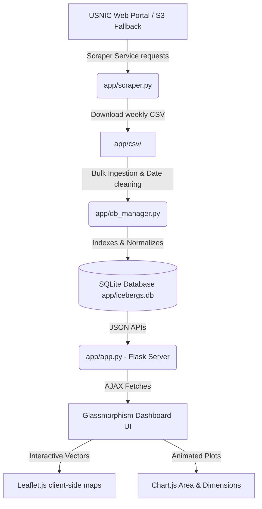

# Iceberg Sentinel — Polar Command Center & Tracking Dashboard

**Iceberg Sentinel** es una plataforma profesional, interactiva y de alto rendimiento diseñada para la telemetría, el análisis geográfico y el seguimiento histórico de icebergs en el continente Antártico, utilizando datos oficiales y actualizados de la **U.S. National Ice Center (USNIC)**.

El proyecto ha sido completamente rediseñado bajo estándares de ingeniería de software de primer nivel, logrando un rendimiento óptimo de consulta en microsegundos y una experiencia visual de usuario (UX/UI) futurista de tipo *Sci-Fi* con estética *Dark Glassmorphism*.

---

## 🚀 Características Clave (Nivel Profesional)

* **Rendimiento en Microsegundos con SQLite**: Se eliminó la ineficiente lectura iterativa de más de 520 archivos CSV por cada petición web. El sistema ahora opera sobre una base de datos SQLite indexada (`app/icebergs.db`), que reduce los tiempos de consulta de ~10 segundos a **menos de 5 milisegundos**.
* **Mapeo Vectorial Dinámico en Cliente (Leaflet.js)**: En lugar de renderizar mapas estáticos y pesados en el servidor utilizando Folium e iframes, toda la renderización geográfica ocurre de forma fluida en el navegador.
* **Visores de Mapas Satelitales**: Incluye un selector dinámico para intercambiar la capa del mapa entre el modo de datos *CartoDB Dark Matter* y la vista de satélite polar de alta resolución *Esri World Imagery*.
* **Análisis de Pérdida de Masa (Chart.js)**: Gráficos dinámicos e interactivos que visualizan el decrecimiento del área superficial del iceberg (`Area sqKM`) a lo largo del tiempo debido al derretimiento y desprendimientos (*calving*), así como la comparación histórica de dimensiones (Largo vs Ancho).
* **Buscador Predictivo con Autocompletado**: Entrada de búsqueda instantánea para filtrar y volar a través de los datos geográficos de más de 500 icebergs históricos y activos.
* **Sincronizador e Ingestor Inteligente (Scraper)**: Módulo integrado capaz de descargar automáticamente la telemetría semanal en formato CSV directamente del portal de la USNIC (con *Content-Disposition* dinámico) y realizar un procesamiento y deduplicación automática mediante restricciones únicas de base de datos. Posee endpoints de contingencia hacia buckets de AWS S3 en caso de fallos de red en el portal gubernamental.

---

## 🛠️ Arquitectura del Sistema

El flujo de procesamiento e interfaz del sistema está estructurado modularmente de la siguiente manera:



---

## 📋 Requisitos e Instalación

### 1. Clonar e Instalar Dependencias
Asegúrate de contar con Python 3.10 o superior y ejecuta:

```bash
# Instalar los módulos de procesamiento, base de datos y scraping
pip install -r requirements.txt
```

### 2. Iniciar el Servidor de Control
Dirígete a la carpeta `app` y ejecuta el servidor de Flask:

```bash
cd app
python app.py
```

*Al iniciarse por primera vez, si el sistema detecta que la base de datos `icebergs.db` está vacía, iniciará de forma automática y asíncrona la importación masiva de los 520+ archivos CSV históricos contenidos en el directorio `csv/archive`, dejándolo listo para su uso inmediato.*

---

## 🔗 APIs y Endpoints Disponibles

Para integraciones externas o desarrollos a futuro, el servidor expone los siguientes endpoints REST:

* `GET /api/stats`: Devuelve las estadísticas globales del sistema (cantidad de registros, icebergs únicos, cobertura temporal y el iceberg más grande del registro actual).
* `GET /api/latest-positions`: Devuelve las coordenadas, dimensiones y metadatos más recientes de todos los icebergs activos en la Antártida.
* `GET /api/iceberg/<name>`: Devuelve la trayectoria cronológica completa de un iceberg determinado, con datos históricos detallados de latitud, longitud y área superficial.
* `POST /api/sync-data`: Activa el Scraper para conectarse con la USNIC, descargar el último informe semanal e insertarlo de forma segura en la base de datos.
* `POST /api/rebuild-db`: Realiza una limpieza completa y vuelve a ingestar en bloque todos los archivos CSV locales (históricos y nuevos), ideal para labores de mantenimiento.